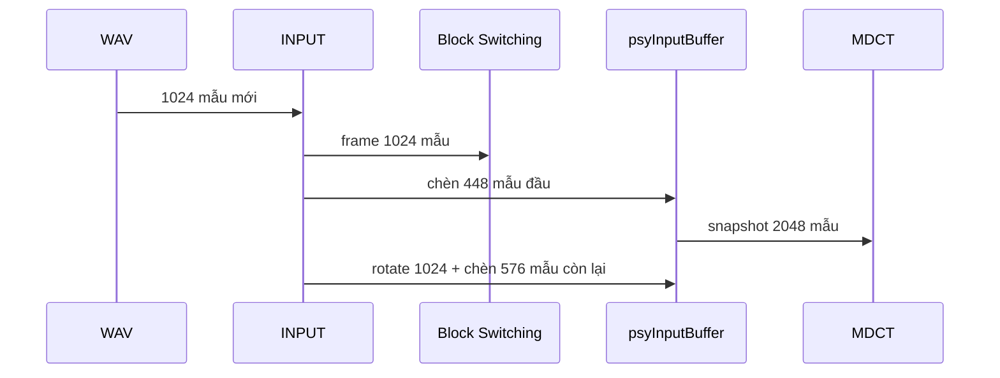

# INPUT — chuẩn bị dữ liệu cho pipeline AAC-LC

## 1. Vai trò

Hạng mục INPUT đọc WAV PCM16 mono và tạo hai luồng dữ liệu có quan hệ thời gian
khác nhau:

- 1024 mẫu mới cho Block Switching phân tích transient;
- snapshot `psyInputBuffer[2048]` cho Window/MDCT.

INPUT không tự chạy Block Switching, windowing hoặc MDCT. Nó chịu trách nhiệm
đọc dữ liệu, duy trì lịch sử buffer và ánh xạ đúng chỉ số mẫu để các khối sau có
thể kiểm thử độc lập.

## 2. Mã nguồn đã tổng hợp

| File trong `my_workspace/INPUT` | Chức năng |
|---|---|
| `input_pipeline_ref.cpp` | Đọc RIFF/WAVE PCM16 mono; chia frame 1024 mẫu; mô phỏng việc fan-out input của `FDKaacEnc_psyMain()`; xuất vector cho Block Switching và snapshot MDCT. |
| `wav_to_fft_input.py` | Chuyển WAV PCM16 thành vector phức Q1.23 phục vụ mô hình NumPy và testbench FFT/RTL. |

## 3. Hợp đồng dữ liệu

Input chuẩn của dự án:

| Thuộc tính | Giá trị |
|---|---|
| Container | RIFF/WAVE |
| Codec | PCM không nén |
| Kênh | Mono |
| Độ rộng mẫu | Signed 16-bit little-endian |
| Tần số mẫu dùng trong bộ test chính | 48 kHz |
| Độ dài frame AAC-LC | 1024 mẫu |

Với frame `f`, Block Switching nhận:

```text
x[1024*f ... 1024*f + 1023]
```

MDCT nhận snapshot:

```text
x[1024*f - 1600 ... 1024*f + 447]
```

Các chỉ số âm ở thời điểm khởi động được điền zero. Chênh lệch biên phải là 576
mẫu, tương đương 12 ms ở 48 kHz; đây là look-ahead để Block Switching quyết định
loại cửa sổ trước khi transient đi vào MDCT.

## 4. Quy tắc cập nhật buffer MDCT

`psyInputBuffer` có 2048 phần tử và được cập nhật theo trình tự:

1. Ghi 448 mẫu đầu của frame mới vào vị trí `1600..2047`.
2. Window/MDCT đọc toàn bộ snapshot 2048 mẫu.
3. Dịch `B[1024..2047]` về `B[0..1023]`.
4. Ghi 576 mẫu còn lại của frame vào `B[1024..1599]`.



## 5. Dữ liệu đầu ra của reference generator

- `meta.txt`: metadata WAV và tham số buffer;
- `frame_map.csv`: vùng mẫu tuyệt đối của Block Switching và MDCT;
- `block_switch_input.txt` / `.raw`: stimulus 1024 mẫu theo frame;
- `mdct_input_buffer.txt` / `.raw`: snapshot 2048 mẫu theo frame;
- vector Q1.23: input phức cho FFT NumPy/RTL.

## 6. Tiêu chí kiểm tra

- mỗi frame Block Switching có đúng 1024 mẫu liên tiếp;
- mỗi snapshot MDCT có đúng 2048 mẫu và zero-padding chỉ xuất hiện khi startup;
- sau frame thứ hai, snapshot chứa đủ 2048 mẫu WAV hợp lệ;
- ánh xạ `frame_map.csv` không có lặp hoặc đứt quãng ngoài phần zero-padding;
- chuyển đổi fixed-point giữ đúng dấu, độ rộng và quy tắc lượng tử đã chọn.

## 7. Kết luận

INPUT là cầu nối thời gian của toàn pipeline. Sai offset 448/576 hoặc sai thứ tự
rotate sẽ làm phổ MDCT sai dù bản thân RTL MDCT vẫn đúng. Vì vậy mọi kiểm thử
end-to-end cần xác nhận `frame_map.csv` trước khi đánh giá các khối sau.

