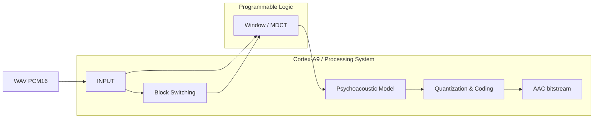

# Báo cáo tổng hợp AAC-LC HW/SW Codesign

Thư mục này là bản bàn giao rút gọn của `my_workspace`. Mỗi hạng mục có đúng một
`README.md` tổng hợp và kèm theo các file code/build config tương ứng. Tài liệu
rời, vector kiểm thử, ảnh, ZIP, file build và artifact phần cứng không được sao
chép, giúp repository đủ mã nguồn nhưng vẫn gọn để đưa lên Git.

## 1. Mục tiêu dự án

Dự án nghiên cứu bộ mã hóa AAC-LC dựa trên FDK-AAC và phân chia xử lý giữa hai
phần của PYNQ-Z2:

- **PS (Cortex-A9):** đọc input, Block Switching, Psychoacoustic Model,
  Quantization/Coding và tạo bitstream AAC;
- **PL (FPGA):** tăng tốc Window/MDCT bằng số học fixed-point tương thích FDK.



## 2. Các hạng mục

| Hạng mục | Vai trò | Mã nguồn đã khảo sát | Nền tảng | Trạng thái chính |
|---|---|---:|---|---|
| [INPUT](INPUT/) | Đọc WAV, chia frame, dựng buffer 2048 mẫu | 2 file | PS/host | Có reference/stimulus generator |
| [Block Switching](block_switch/) | Phát hiện transient, chọn LONG/START/SHORT/STOP | 5 file | PS | PASS bit-exact 292 frame/25 kịch bản |
| [Window/MDCT](window_mdct/) | Window, TDAC fold, DCT-IV qua FFT radix-2 | 56 file | PL + driver PS | RTL/golden khớp 0 LSB |
| [Psychoacoustic Model](psychoacoustic_model/) | SFB, masking, TNS/PNS và tạo `PSY_OUT` | 0 file riêng; khảo sát source FDK | PS | Đã chốt ranh giới tích hợp MDCT |
| [Quantization/Coding](quantization_coding/) | Scalefactor, quantize, bit count, Huffman | 18 file | PS; QMAX là ứng viên PL | Reference ready, RTL chưa bắt đầu |
| [PYNQ-Z2](pynq_z2/) | Build native, chạy encoder và profiling trên board | 2 script | PS/board | Có quy trình baseline và profiling |

Tổng cộng có **83 file code/build config** được chuyển từ `my_workspace`, giữ
nguyên đường dẫn tương đối và được mô tả trong sáu README chuyên mục.

## 3. Luồng dữ liệu và giao diện chính

1. `INPUT` nhận WAV mono PCM16, đưa 1024 mẫu mới cho Block Switching và duy trì
   snapshot 2048 mẫu cho Window/MDCT.
2. Block Switching trả `blockType`, `windowShape`, `noOfGroups` và `groupLen[]`.
3. MDCT nhận 2048 mẫu Q15 cùng tín hiệu điều khiển cửa sổ, trả 1024 hệ số Q31 và
   một exponent chung.
4. Psychoacoustic Model tính năng lượng/masking theo SFB, áp dụng các công cụ âm
   học và tạo `PSY_OUT`.
5. Quantization/Coding điều chỉnh threshold, tìm scalefactor/global gain, lượng
   tử hóa phổ, chọn codebook/section và ghi bitstream AAC.

## 4. Kết quả nổi bật

- Block Switching khớp bit-exact trên 292 frame thuộc 25 kịch bản.
- FFT-64, FFT-512 và toàn bộ MDCT RTL khớp golden tại mọi điểm kiểm tra với sai
  số `0 LSB`.
- Mô hình C++ và Python của MDCT khớp nhau; đối chiếu float64 đạt SNR tổng hợp
  khoảng `94.52 dB` trên bộ 18 frame.
- Spectral quantizer reference khớp trực tiếp kernel FDK ở các bộ vector long,
  zero và grouped-short/dead-zone với `0 mismatch`.
- FDK-AAC đã có flow build/chạy trên Cortex-A9 và script profiling theo khối.
- AXI4-Lite phù hợp bring-up/regression; đường dữ liệu thời gian thực vẫn cần
  C++ HAL và AXI DMA/AXI-Stream.

## 5. Cấu trúc bản báo cáo

```text
my_workspace_aac/
├── README.md
├── INPUT/                    README + C++/Python input tools
├── block_switch/             README + reference/testbench/tools
├── window_mdct/              README + RTL/reference/driver/test/build flow
├── psychoacoustic_model/     README (không có code riêng trong workspace gốc)
├── quantization_coding/      README + C++/Python reference/regression
└── pynq_z2/                  README + script baseline/profiling
```

## 6. Phạm vi và nguồn tổng hợp

Bản bàn giao được tổng hợp từ snapshot cục bộ `my_workspace` ngày 18/09/2026.
Các đường dẫn source trong từng README cũng là đường dẫn tương đối trong repo
này. Một số harness vẫn tham chiếu source FDK-AAC ở repository cha, nên cần đặt
repo này cạnh source FDK-AAC nếu muốn chạy nguyên các lệnh build đó.
