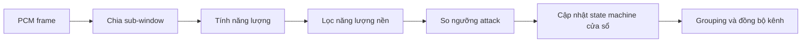

# Block Switching — phát hiện transient và chọn cửa sổ

## 1. Vai trò

Block Switching phân tích năng lượng theo các sub-window để phát hiện transient
và điều khiển chuỗi cửa sổ AAC-LC:

```text
LONG → START → SHORT → STOP → LONG
```

Khối nhận 1024 mẫu PCM của mỗi frame, duy trì trạng thái giữa các frame và xuất
loại cửa sổ, hình dạng cửa sổ và thông tin grouping cho MDCT/Psy.

## 2. Mã nguồn đã tổng hợp

| File trong `my_workspace/block_switch` | Chức năng |
|---|---|
| `ref/ref_block_switch.h` | Khai báo kiểu dữ liệu và API của mô hình tham chiếu độc lập, không include FDK-AAC. |
| `ref/ref_block_switch.cpp` | Hiện thực fixed-point độc lập dựa trên thuật toán của `libAACenc/src/block_switch.cpp`; dùng làm golden. |
| `tb/test_block_switch.cpp` | Harness quan sát DUT FDK; sinh tín hiệu, chạy từng frame và xuất toàn bộ `BLOCK_SWITCHING_CONTROL`. |
| `tb/verify_block_switch.cpp` | Harness đối chiếu DUT với reference theo ba lớp: bit-exact, bất biến trạng thái và kịch bản chuyển cửa sổ. |
| `tools/dump_wav_block_switch.cpp` | Đọc WAV/RAW PCM16 thật, chạy reference theo frame và xuất input/trace ở dạng text/CSV. |

## 3. Input và output

Input chính:

- PCM signed 16-bit;
- AAC-LC: 1024 mẫu/frame, chia thành 8 sub-window × 128 mẫu;
- cấu hình AAC-LD có thể dùng 512 mẫu/frame và 4 sub-window;
- state năng lượng/cửa sổ từ frame trước.

Output chính:

- `attack` và `attackIndex`;
- `blockType`/window sequence: LONG, START, SHORT hoặc STOP;
- `windowShape`;
- `noOfGroups` và `groupLen[]`;
- năng lượng hiện tại/lọc của từng sub-window.

## 4. Luồng thuật toán



Với stereo, `FDKaacEnc_SyncBlockSwitching()` đồng bộ quyết định giữa hai kênh khi
dùng common window. LFE bỏ qua phần phân tích transient theo cấu hình.

## 5. Kiểm thử đã có

Các tín hiệu tổng hợp chính gồm silence, steady sine, single attack, castanets và
slow crescendo. Bộ test còn bao phủ AAC-LC, AAC-LD, LFE và hai chế độ đồng bộ
stereo.

Kết quả được ghi nhận trong workspace:

```text
PASS — 0 sai khác bit-exact trên 292 frame / 25 kịch bản
```

Harness quan sát dùng để hiểu hành vi; harness đối chiếu trả exit code khác 0 nếu
bất kỳ trường trạng thái hoặc output nào lệch reference.

## 6. Vị trí trong kiến trúc PYNQ-Z2

Block Switching được giữ trên Cortex-A9 vì khối có state, nhánh điều khiển và chi
phí tính toán nhỏ hơn MDCT. Output của nó đi vào control plane của MDCT qua
`block_type`, `right_shape` và xung `start`; dữ liệu PCM không nối thẳng vào FFT.

## 7. Kết luận

Reference độc lập và bộ regression bit-exact tạo một hợp đồng điều khiển đáng tin
cậy cho MDCT RTL. Khi tích hợp end-to-end, cần kiểm tra cả quyết định cửa sổ lẫn
độ lệch thời gian 576 mẫu do INPUT duy trì.

