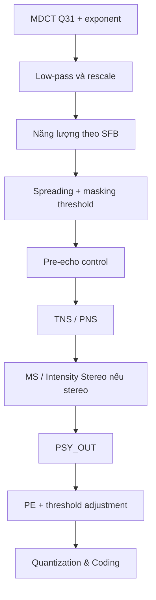

# Psychoacoustic Model — mô hình cảm nhận AAC-LC

## 1. Vai trò

Psychoacoustic Model nhận phổ MDCT và chuyển nó thành các ràng buộc cảm nhận theo
scalefactor band (SFB). Mục tiêu là phân bổ sai số lượng tử vào vùng ít nghe thấy
trong khi vẫn đáp ứng ngân sách bit.

```text
MDCT spectrum
  → năng lượng theo SFB
  → spreading/masking threshold
  → pre-echo control
  → TNS/PNS/MS/Intensity Stereo
  → PSY_OUT
```

## 2. Source FDK-AAC được khảo sát

Hạng mục này không tạo code riêng trong `my_workspace`; tài liệu được tổng hợp từ
các file của thư viện gốc:

| Source | Nội dung liên quan |
|---|---|
| `libAACenc/src/aacenc.cpp` | Trình tự top-level của một frame encoder. |
| `libAACenc/src/psy_main.cpp` | Block Switching, transform, xử lý phổ, SFB, TNS và tạo `PSY_OUT`. |
| `libAACenc/src/psy_configuration.cpp` | Cấu hình theo sample rate, bitrate và loại block. |
| `libAACenc/src/interface.h` | Cấu trúc giao tiếp giữa Psy và Quantization/Coding. |
| `libAACenc/src/qc_main.cpp` | Điểm tiêu thụ `PSY_OUT` trong rate/quantization loop. |
| `libAACenc/src/adj_thr.cpp` | PE, bit allocation và điều chỉnh masking threshold. |
| `libAACenc/src/quantize.cpp` | Lượng tử hóa/inverse quantization và distortion. |
| `libAACenc/src/dyn_bits.cpp` | Sectioning và dynamic bit count. |
| `libAACenc/src/bit_cnt.cpp` | Chi phí Huffman/codebook. |
| `libAACenc/src/bitenc.cpp` | Ghi syntax và bitstream AAC. |

## 3. Điểm tích hợp MDCT phần cứng

Trong FDK-AAC, transform được gọi bên trong `FDKaacEnc_psyMain()`. Thiết kế không
thay toàn bộ Psy mà chỉ thay backend của:

```text
FDKaacEnc_Transform_Real()
```

Accelerator cần trả về đúng hợp đồng:

```text
mdctSpectrum[1024] + mdctSpectrum_e
```

Sau đó low-pass/rescale, TNS, tính năng lượng/threshold, stereo tools và toàn bộ
Quantization/Coding tiếp tục chạy trên Cortex-A9.

## 4. Luồng xử lý một frame



## 5. Dữ liệu đầu ra quan trọng

`PSY_OUT` chứa phổ đã xử lý và metadata theo channel/SFB, gồm năng lượng,
threshold, min-SNR, grouping/window information và quyết định của các công cụ
âm học. Quantizer không được dùng trực tiếp output thô của MDCT PL vì TNS và các
công cụ stereo có thể đã thay đổi spectrum.

## 6. Phân chia PS/PL

| Thành phần | Vị trí phiên bản đầu | Lý do |
|---|---|---|
| Window/MDCT | PL | Datapath đều, fixed-point, khối lượng tính toán lớn. |
| SFB energy/threshold | PS | Nhiều bảng cấu hình, scale và nhánh theo mode. |
| TNS/PNS | PS | Có state và quyết định phụ thuộc tín hiệu. |
| MS/Intensity Stereo | PS | Chỉ dùng theo cấu hình stereo và thay đổi phổ. |
| PE/threshold adjustment | PS | Gắn với rate control và bit reservoir. |

## 7. Kế hoạch kiểm chứng

- tạo trace ngay trước/sau `FDKaacEnc_Transform_Real()`;
- so sánh toàn bộ `mdctSpectrum[1024]` và exponent giữa software/PL;
- so sánh năng lượng, threshold và quyết định tool theo SFB;
- chạy cùng input, cấu hình, compiler flags và trạng thái encoder;
- cuối cùng so sánh bitstream và decode output end-to-end.

## 8. Kết luận

Psychoacoustic Model nên giữ trên PS trong phiên bản đầu. Ranh giới thay thế hẹp
tại backend MDCT làm giảm rủi ro và cho phép dùng nguyên logic FDK-AAC sau
transform.

